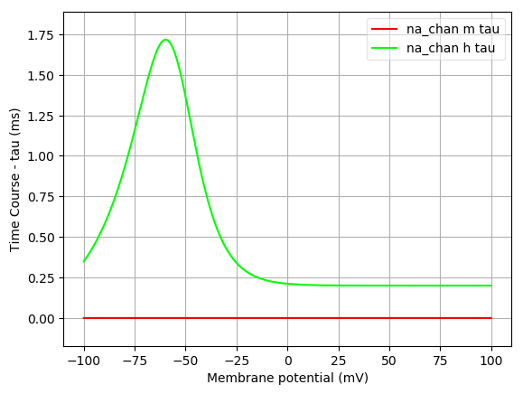
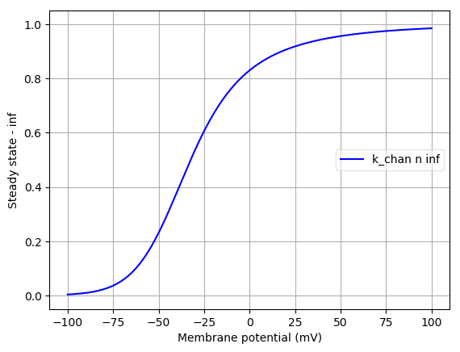
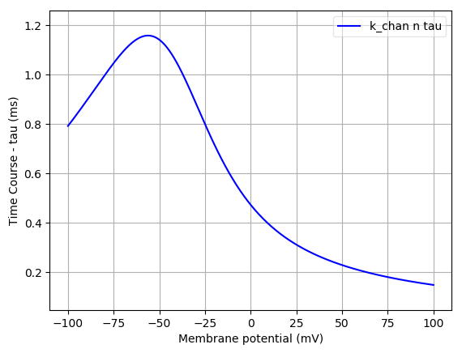
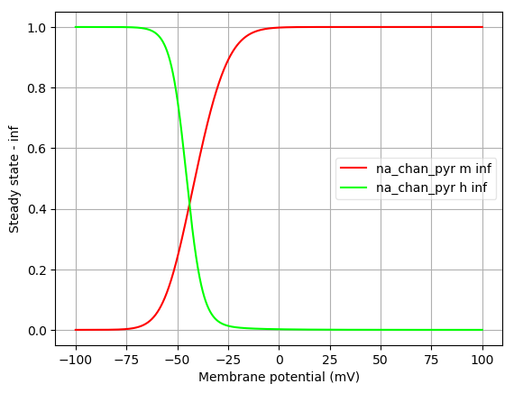

Channel information
===================
    

Channel information at: T = 34.0 degC, E_rev = 0 mV, [Ca2+] = 5e-05 mM

<table>
    <tr>
<td width="120px">
            <b>na_chan</b> 
            <a href="../WangBuzsaki.cell.nml">WangBuzsaki.cell.nml</a> 
            <b>Ion: na</b> 
            <i>g = gmax * m3 * h </i> 
            ${channel.notes}
</td>
<td>

</td>
<td>

</td>
</tr>
    <tr>
<td width="120px">
            <b>k_chan</b> 
            <a href="../WangBuzsaki.cell.nml">WangBuzsaki.cell.nml</a> 
            <b>Ion: k</b> 
            <i>g = gmax * n4 </i> 
            ${channel.notes}
</td>
<td>

</td>
<td>

</td>
</tr>
    <tr>
<td width="120px">
            <b>na_chan_pyr</b> 
            <a href="../PyramidalCell.cell.nml">PyramidalCell.cell.nml</a> 
            <b>Ion: na</b> 
            <i>g = gmax * m3 * h </i> 
            ${channel.notes}
</td>
<td>

</td>
<td>

</td>
</tr>
    <tr>
<td width="120px">
            <b>k_chan_pyr</b> 
            <a href="../PyramidalCell.cell.nml">PyramidalCell.cell.nml</a> 
            <b>Ion: k</b> 
            <i>g = gmax * n4 </i> 
            ${channel.notes}
</td>
<td>

</td>
<td>

</td>
</tr>
</table>

